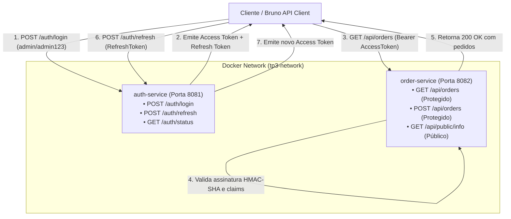

# TP3: Autenticação e Autorização em Microsserviços

Projeto desenvolvido para a disciplina de Microsserviços, implementando autenticação e autorização stateless baseadas em **Tokens JWT (JSON Web Tokens)** entre múltiplos serviços Spring Boot 3.

---

## 1. Arquitetura da Solução

O sistema é composto por dois microsserviços independentes conteinerizados com Docker:



### Componentes:
- **`auth-service` (Porta 8081)**: Microsserviço de autenticação e identidade. Valida credenciais de usuários, assina e emite **Access Tokens** (curta duração, 15 min) e **Refresh Tokens** (longa duração, 24h).
- **`order-service` (Porta 8082)**: Microsserviço de negócio contendo rotas protegidas (gerenciamento de pedidos) e rotas públicas. Intercepta requisições via filtro de segurança (`JwtAuthenticationFilter`), valida a assinatura digital e autoriza a operação sem necessidade de chamadas síncronas ao `auth-service`.

---

## 2. Justificativa da Escolha Tecnológica (JWT vs Keycloak)

Para este projeto, optou-se pela implementação direta com **JWT (JSON Web Token)** utilizando a biblioteca `io.jsonwebtoken` (JJWT 0.12.6) e o ecossistema nativo do **Spring Security 6**.

### Motivações:
1. **Consumo de Recursos e Eficiência**: Uma instância do Keycloak requer um banco de dados relacional dedicado (PostgreSQL/MySQL) e JVM com alocação mínima superior a 1 GB de memória RAM, inviabilizando ambientes de desenvolvimento leves ou máquinas de avaliação com limites de recursos. Em contrapartida, a solução JWT é extremamente leve (executa em contêineres Alpine JRE com `~64MB` de heap cada).
2. **Arquitetura Stateless e Desacoplamento**: O JWT permite que o `order-service` valide as credenciais e claims (`role`, `token_type`, `exp`, `sub`) de forma autônoma e descentralizada, apenas verificando a chave de assinatura HMAC criptograficamente segura, eliminando chamadas de rede adicionais para validação de sessão.
3. **Controle Granular de Ciclo de Vida**: Implementação explícita da separação estrita entre **Access Token** (tipo `ACCESS`) e **Refresh Token** (tipo `REFRESH`), garantindo que tokens de refresh não possam ser usados indevidamente para acessar recursos protegidos.

---

## 3. Credenciais Pré-configuradas

Os usuários já vêm previamente cadastrados em memória com senhas hasheadas via **BCrypt**:

| Usuário | Senha | Perfil (Role) | Descrição |
| :--- | :--- | :--- | :--- |
| `admin` | `admin123` | `ROLE_ADMIN` | Administrador do sistema |
| `user` | `user123` | `ROLE_USER` | Usuário padrão |

---

## 4. Tabela de Endpoints

### 4.1. `auth-service` (Porta 8081)

| Método | Endpoint | Protegido? | Descrição | Status Sucesso |
| :--- | :--- | :---: | :--- | :---: |
| `POST` | `/auth/login` | Não | Autentica usuário e emite par de tokens | `200 OK` |
| `POST` | `/auth/refresh` | Não | Renova o access token a partir de um refresh token válido | `200 OK` |
| `GET` | `/auth/status` | Não | Verificação de disponibilidade do serviço | `200 OK` |

### 4.2. `order-service` (Porta 8082)

| Método | Endpoint | Protegido? | Descrição | Status Sucesso |
| :--- | :--- | :---: | :--- | :---: |
| `GET` | `/api/public/info` | **Não (Público)** | Retorna informações gerais do serviço | `200 OK` |
| `GET` | `/api/orders` | **Sim (Bearer JWT)** | Lista todos os pedidos cadastrados | `200 OK` |
| `GET` | `/api/orders/{id}` | **Sim (Bearer JWT)** | Retorna um pedido específico por ID | `200 OK` |
| `POST` | `/api/orders` | **Sim (Bearer JWT)** | Cadastra novo pedido associado ao usuário logado | `201 Created` |

---

## 5. Como Executar

### Pré-requisitos
- Docker e Docker Compose instalados **OU** Java 21+ e Apache Maven 3.9+.

### Opção A: Execução via Docker Compose (Recomendada)

1. No diretório raiz do projeto (`TP-Microservicos-Spring-3`), execute:
   ```bash
   docker compose up -d --build
   ```

2. Verifique o status dos serviços:
   ```bash
   docker compose ps
   ```

3. Para acompanhar os logs de ambos os serviços:
   ```bash
   docker compose logs -f
   ```

4. Para parar a execução:
   ```bash
   docker compose down
   ```

### Opção B: Execução Local via Maven

Se preferir rodar diretamente no terminal:

```bash
# Terminal 1: Auth Service (Porta 8081)
cd auth-service
mvn spring-boot:run

# Terminal 2: Order Service (Porta 8082)
cd order-service
mvn spring-boot:run
```

---

## 6. Como Testar com o Bruno API Client

A pasta [`bruno/`](./bruno) contém a coleção completa configurada para testar todos os cenários de avaliação.

### Passo a Passo no Bruno:
1. Abra o **Bruno**.
2. Clique em **Open Collection** e selecione a pasta `bruno/` deste repositório.
3. No canto superior direito, selecione o ambiente **`local`**.
4. Execute as requisições na ordem numérica:

| Sequência | Arquivo `.bru` | Método e URL | Comportamento Esperado |
| :---: | :--- | :--- | :--- |
| **1** | `01-Acesso-Sem-Autenticacao.bru` | `GET {{order_url}}/api/orders` | Retorna `401 Unauthorized` (acesso bloqueado) |
| **2** | `02-Login-Credencial-Invalida.bru` | `POST {{auth_url}}/auth/login` | Retorna `401 Unauthorized` com mensagem de erro |
| **3** | `03-Login-Sucesso.bru` | `POST {{auth_url}}/auth/login` | Retorna `200 OK` e **armazena automaticamente** `access_token` e `refresh_token` no ambiente |
| **4** | `04-Acessar-Rota-Protegida.bru` | `GET {{order_url}}/api/orders` | Retorna `200 OK` utilizando o `access_token` obtido |
| **5** | `05-Criar-Pedido-Protegido.bru` | `POST {{order_url}}/api/orders` | Retorna `201 Created` e associa o pedido ao usuário autenticado |
| **6** | `06-Refresh-Token.bru` | `POST {{auth_url}}/auth/refresh` | Retorna `200 OK` e **atualiza automaticamente** o `access_token` no ambiente |
| **7** | `07-Acessar-Com-Novo-Token.bru` | `GET {{order_url}}/api/orders` | Retorna `200 OK` comprovando que o novo token é aceito |
| **8** | `08-Endpoint-Publico.bru` | `GET {{order_url}}/api/public/info` | Retorna `200 OK` sem necessitar de autenticação |

> **Nota sobre automação**: As requisições `03-Login-Sucesso` e `06-Refresh-Token` possuem script pós-resposta (`script:post-response`) embutido no arquivo `.bru` que atualiza as variáveis `access_token` e `refresh_token` no ambiente do Bruno de forma 100% transparente.

---

## 7. Execução dos Testes Automatizados (JUnit 5 + MockMvc)

Ambos os projetos possuem testes automatizados de integração cobrindo fluxos de sucesso e falha:

```bash
# Executar testes do auth-service
cd auth-service && mvn test

# Executar testes do order-service
cd ../order-service && mvn test
```
