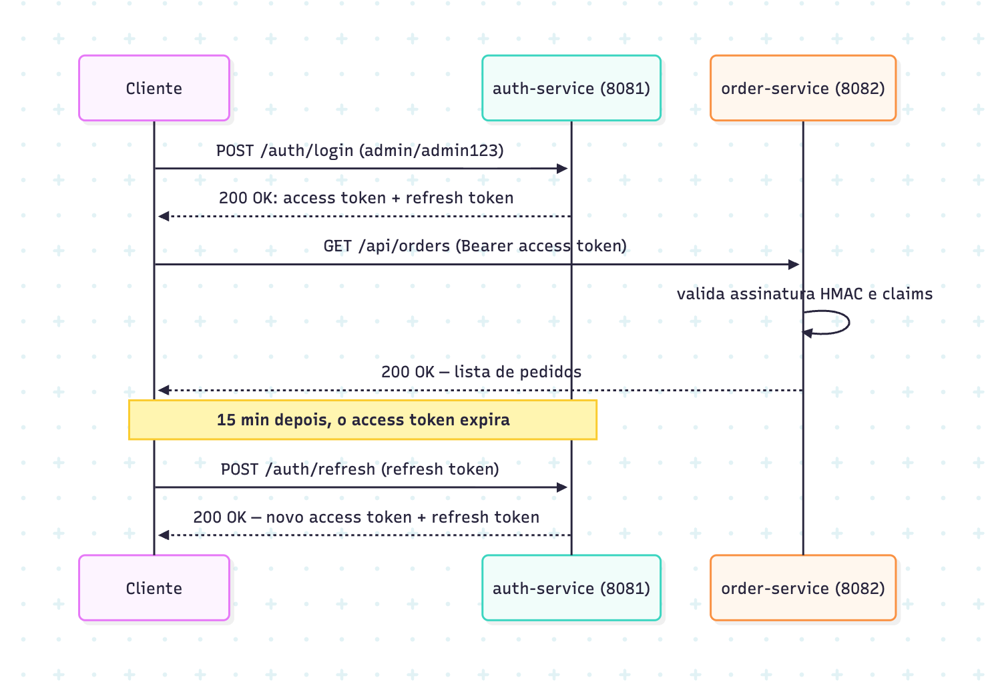
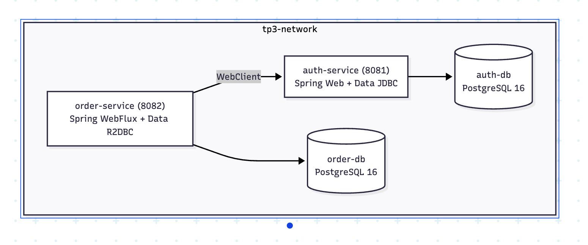

# AT: Microsserviços com Spring Cloud (Continuação TP3)

**Aluno:** João Vitor Pereira de Souza  
**Matrícula:** [Insira sua matrícula aqui]

Trabalho prático focado em microsserviços escaláveis com Spring Boot 3, Spring Cloud (Eureka Server, Config Server, API Gateway, OpenFeign), autenticação JWT e arquitetura distribuída.

A ideia central do projeto foi separar completamente a responsabilidade de quem autentica e emite tokens (`auth-service`) de quem consome e valida as requisições de negócio (`order-service`), mantendo a comunicação descentralizada, sem estado (stateless) e com banco de dados isolado por serviço (*Database-per-Service*).

---

## 1. Visão Geral da Arquitetura

O ecossistema é formado por quatro contêineres rodando em uma mesma rede bridge no Docker (`tp3-network`):



### Modelo Híbrido: Síncrono (JDBC) + Reativo (WebFlux & R2DBC)



### Divisão de Responsabilidades

O `auth-service` (porta 8081) ficou no modelo síncrono: cuida de credenciais e do ciclo de vida dos tokens, persistindo tudo via Spring Data JDBC num PostgreSQL dedicado (`auth-db`), com o schema versionado por Flyway (`V1__create_users.sql`, `V2__seed_users.sql`). Também expõe `GET /auth/users/{username}`, usado pelo `order-service` pra buscar dados do usuário. As migrations e o repositório JDBC têm testes de integração com Testcontainers subindo um PostgreSQL real, não mockado.

Já o `order-service` (porta 8082) é 100% reativo: Spring WebFlux, `Mono`/`Flux` do Project Reactor, e Spring Data R2DBC com o driver assíncrono `r2dbc-postgresql` apontando pro seu próprio banco (`order-db`). O filtro de autenticação virou um `JwtAuthenticationWebFilter` (um `WebFilter` de verdade, integrado ao `ServerHttpSecurity`, não o filtro blocking de antes). Quando alguém consulta ou cria um pedido, o serviço chama o `auth-service` via `WebClient` (não bloqueante, com `flatMap`) pra trazer a `customerRole` e enriquecer a resposta. Os testes cobrem esse fluxo inteiro: `StepVerifier` e `WebTestClient` pro lado reativo, Testcontainers pro PostgreSQL, e `MockWebServer` simulando o `auth-service` sem precisar subir ele de verdade.

Cada serviço só enxerga o próprio banco: `auth-db` guarda a tabela `users` (porta 5433 no host), `order-db` guarda a tabela `orders` (porta 5434 no host), ambos PostgreSQL 16, sem nenhuma tabela compartilhada entre os dois.

---

## 2. Por que JWT em vez de Keycloak?

A especificação do trabalho permitia escolher entre JWT direto ou Keycloak. A opção adotada foi implementar com **JWT puro via Spring Security 6 e JJWT (0.12.6)**:

- **Consumo de Recursos**: Keycloak exige banco de dados próprio e consome facilmente mais de 1 GB de RAM só para subir. Nossos microsserviços rodam com dezenas de megabytes em contêineres Alpine JRE.
- **Arquitetura Desacoplada e Autonomia**: Com o JWT assinado simetricamente (HMAC-SHA), o `order-service` valida autenticidade e permissões em memória, sem latência adicional na checagem de rotas.
- **Tipagem de Tokens**: Distinção clara entre `token_type: ACCESS` (curta duração, 15 min) e `REFRESH` (longa duração, 24h), impedindo o uso indevido de tokens de renovação em rotas de recursos.

---

## 3. Usuários Padrão para Teste

Os usuários são inicializados automaticamente no banco de dados via migrations Flyway, com senhas criptografadas via **BCrypt**:

| Usuário | Senha | Perfil | Descrição |
| :--- | :--- | :--- | :--- |
| `admin` | `admin123` | `ROLE_ADMIN` | Acesso administrativo completo |
| `user` | `user123` | `ROLE_USER` | Usuário padrão para pedidos |

---

## 4. Endpoints Disponíveis

### 4.1. `auth-service` (Porta 8081)

| Método | Rota | Requer Autenticação | Descrição | Status Sucesso |
| :--- | :--- | :---: | :--- | :---: |
| `POST` | `/auth/login` | Não | Valida usuário/senha e emite o par de tokens | `200 OK` |
| `POST` | `/auth/refresh` | Não | Recebe refresh token e emite novos tokens | `200 OK` |
| `GET` | `/auth/users/{username}` | Não | Consulta dados públicos do usuário (consumido pelo WebClient) | `200 OK` |
| `GET` | `/auth/status` | Não | Healthcheck do serviço de autenticação | `200 OK` |

### 4.2. `order-service` (Porta 8082, Reativo)

| Método | Rota | Requer Autenticação | Descrição | Status Sucesso |
| :--- | :--- | :---: | :--- | :---: |
| `GET` | `/api/public/info` | **Não** | Status público da API e instruções de uso | `200 OK` |
| `GET` | `/api/orders` | **Sim (Bearer)** | Fluxo de pedidos enriquecidos com perfil via WebClient | `200 OK` |
| `GET` | `/api/orders/{id}` | **Sim (Bearer)** | Consulta reativa de pedido por ID | `200 OK` |
| `POST` | `/api/orders` | **Sim (Bearer)** | Cria pedido reativo atribuído ao usuário logado | `201 Created` |

---

## 5. Autenticação e Enriquecimento via WebClient

### 5.1. Fazendo Login

```bash
curl -X POST http://localhost:8081/auth/login \
  -H "Content-Type: application/json" \
  -d '{"username": "admin", "password": "admin123"}'
```

Resposta:

```json
{
  "accessToken": "eyJhbGciOiJIUzUxMiJ9...",
  "refreshToken": "eyJhbGciOiJIUzUxMiJ9...",
  "tokenType": "Bearer",
  "expiresIn": 900
}
```

### 5.2. Consulta de Perfil no `auth-service`

Endpoint público consumido pelo `order-service` para obter metadados do usuário:

```bash
curl http://localhost:8081/auth/users/admin
```

Resposta:

```json
{
  "id": 1,
  "username": "admin",
  "role": "ROLE_ADMIN"
}
```

### 5.3. Enriquecimento Reativo no `order-service`

Ao consultar ou cadastrar pedidos com o `accessToken`, o `order-service` executa uma chamada reativa não bloqueante ao `auth-service` usando `WebClient` para obter a `customerRole`:

```bash
curl http://localhost:8082/api/orders \
  -H "Authorization: Bearer <accessToken>"
```

Resposta enriquecida:

```json
[
  {
    "id": 1,
    "customer": "admin",
    "customerRole": "ROLE_ADMIN",
    "item": "MacBook Pro M3 Max",
    "quantity": 1,
    "totalPrice": 19999.0,
    "status": "CONFIRMED"
  },
  {
    "id": 2,
    "customer": "user",
    "customerRole": "ROLE_USER",
    "item": "Monitor Dell UltraSharp 32 4K",
    "quantity": 2,
    "totalPrice": 7200.0,
    "status": "CONFIRMED"
  }
]
```

### 5.4. Criando um Novo Pedido

```bash
curl -X POST http://localhost:8082/api/orders \
  -H "Authorization: Bearer <accessToken>" \
  -H "Content-Type: application/json" \
  -d '{"item": "Kit Manutenção Aviônica Garmin G1000", "quantity": 1, "totalPrice": 14500.00}'
```

Resposta `201 Created`:

```json
{
  "id": 3,
  "customer": "admin",
  "customerRole": "ROLE_ADMIN",
  "item": "Kit Manutenção Aviônica Garmin G1000",
  "quantity": 1,
  "totalPrice": 14500.0,
  "status": "CREATED"
}
```

---

## 6. Como Subir o Projeto

### Opção 1: Via Docker Compose (Recomendado)

Sobe os dois bancos de dados (`auth-db` e `order-db`) com seus respectivos healthchecks, aguarda que estejam saudáveis e inicializa os microsserviços:

```bash
# Build das imagens e subida completa da stack
docker compose up -d --build

# Verificar status dos contêineres e healthchecks
docker compose ps

# Acompanhar logs unificados
docker compose logs -f

# Derrubar a stack quando finalizar
docker compose down
```

### Opção 2: Execução de Testes Automatizados com Testcontainers

Ambos os serviços possuem suítes completas de testes de integração que sobem contêineres PostgreSQL temporários via Testcontainers automaticamente:

```bash
# Testes do auth-service (Spring Data JDBC + Flyway + Testcontainers)
cd auth-service
mvn test

# Testes do order-service (WebFlux + R2DBC + WebTestClient + Testcontainers + MockWebServer)
cd ../order-service
mvn test
```

---

## 7. Coleção de Requisições (Bruno)

A pasta [`bruno/`](./bruno) contém todas as requisições configuradas para testar o fluxo ponta a ponta (login com credenciais válidas e inválidas, refresh token, chamadas autenticadas e enriquecimento via WebClient).
