# Assessment Test (AT): Microsserviços com Spring Cloud

[](https://github.com/joaovsz/TP-Microservicos-Spring-3/actions/workflows/ci.yml)


**Aluno:** João Vitor Pereira de Souza  
**Matrícula:** 70636043177  
**Repositório:** [joaovsz/TP-Microservicos-Spring-3](https://github.com/joaovsz/TP-Microservicos-Spring-3)  
**Pull Request:** [#1 Atividade AT - João Vitor Pereira de Souza](https://github.com/joaovsz/TP-Microservicos-Spring-3/pull/1)

---

## 1. Visão Geral da Arquitetura do AT

Este projeto representa a implementação completa do **Assessment Test (AT)** da disciplina de **Microsserviços e Engenharia de Softwares Escaláveis**. 

Partindo da base desenvolvida em sala de aula e no TP3, o ecossistema foi expandido com a arquitetura completa do **Spring Cloud**, incluindo Service Discovery, Configuração Centralizada, Roteamento Dinâmico por API Gateway, Comunicação Declarativa com OpenFeign, Banco H2 em memória, Conteinerização com Docker Compose e Pipeline de Integração Contínua (CI) com GitHub Actions.



---

## 2. Mapa de Portas e Microsserviços

| Microsserviço | Porta | Tecnologia Principal | Papel no Ecossistema |
| :--- | :---: | :--- | :--- |
| **`eureka-server`** | `8761` | Spring Cloud Netflix Eureka | Registro e Descoberta de Serviços (*Service Registry*) |
| **`config-server`** | `8888` | Spring Cloud Config Server | Centralização e externalização de propriedades via `config-repo/` |
| **`produtos-service`** | `8081` | Spring Boot Web + Eureka Client | Catálogo de produtos consultado via OpenFeign |
| **`fornecedores-service`** | `8084` | Spring Boot Data JPA + H2 + Feign | **Serviço principal do AT:** CRUD de fornecedores e integração |
| **`api-gateway`** | `8085` | Spring Cloud Gateway + Eureka | Ponto único de entrada e roteador dinâmico de requisições |

---

## 3. Estrutura do Novo Microsserviço: `fornecedores-service`

O microsserviço [`fornecedores-service`](./fornecedores-service) foi construído no pacote `br.edu.infnet.fornecedores`, atendendo a todos os requisitos de domínio e validação:

* **Entidade `Fornecedor`:**
  * `id`: Chave primária gerada automaticamente (`GenerationType.IDENTITY`).
  * `nome`: Obrigatório (`@NotBlank`, `@Column(nullable = false)`).
  * `cnpj`: Obrigatório e exclusivo (`@NotBlank`, `@Column(nullable = false, unique = true)`).
  * `email` e `telefone`: Informações complementares de contato.
* **Repositório:** `FornecedorRepository extends JpaRepository<Fornecedor, Long>`.
* **Carga Inicial Automática (`DataInitializer`):**
  Ao iniciar a aplicação, 5 fornecedores padrão são persistidos no H2 em memória caso a base esteja vazia:
  1. *Tech Distribuidora LTDA* (CNPJ: `11.222.333/0001-44`)
  2. *Global Pecas e Componentes* (CNPJ: `22.333.444/0001-55`)
  3. *Logistica Express Brasil* (CNPJ: `33.444.555/0001-66`)
  4. *Alimentos Brasil S/A* (CNPJ: `44.555.666/0001-77`)
  5. *Papelaria Central Atacadista* (CNPJ: `55.666.777/0001-88`)
* **Console H2:** Habilitado em `http://localhost:8084/h2-console` (JDBC URL: `jdbc:h2:mem:fornecedoresdb`, User: `sa`).

---

## 4. Endpoints Disponíveis

### 4.1. `fornecedores-service` (Acesso Direto: `8084` | Via Gateway: `8085`)

| Método | Rota Direta (8084) | Rota Gateway (8085) | Descrição | Status Retorno |
| :--- | :--- | :--- | :--- | :---: |
| `GET` | `/fornecedores` | `/fornecedores` | Lista todos os fornecedores cadastrados | `200 OK` |
| `GET` | `/fornecedores/{id}` | `/fornecedores/{id}` | Consulta fornecedor por ID (ou 404 se não existir) | `200 OK` / `404 Not Found` |
| `POST` | `/fornecedores` | `/fornecedores` | Cadastra novo fornecedor a partir de JSON | `201 Created` |
| `GET` | `/fornecedores/produtos` | `/fornecedores/produtos` | **OpenFeign:** Consulta o catálogo do `produtos-service` | `200 OK` |

### 4.2. Exemplo de Requisição `POST /fornecedores`

```bash
curl -X POST http://localhost:8085/fornecedores \
  -H "Content-Type: application/json" \
  -d '{
    "nome": "Distribuidora Beta Tech",
    "cnpj": "12.345.678/0001-99",
    "email": "contato@betatech.com",
    "telefone": "(11) 98888-7777"
  }'
```

Resposta (`201 Created`):
```json
{
  "id": 6,
  "nome": "Distribuidora Beta Tech",
  "cnpj": "12.345.678/0001-99",
  "email": "contato@betatech.com",
  "telefone": "(11) 98888-7777"
}
```

---

## 5. Integrações Spring Cloud Implementadas

1. **Service Discovery com Eureka Server:**
   * Todos os microsserviços utilizam `@EnableDiscoveryClient` e se registram no Eureka (`http://localhost:8761`).
   * Configuração de sincronização rápida (5s) para atualização dinâmica imediata da topologia.
2. **Spring Cloud Config Server e `config-repo`:**
   * Configurações centralizadas na pasta [`config-repo/`](./config-repo).
   * O `fornecedores-service` busca dinamicamente suas propriedades via `spring.config.import=optional:configserver:http://localhost:8888`.
3. **Comunicação Declarativa com OpenFeign:**
   * O `fornecedores-service` utiliza `@EnableFeignClients` e a interface `ProdutoClient` para consumir o `produtos-service` sem necessidade de URLs fixas no código, balanceando a carga via Eureka.
4. **Roteamento Dinâmico com API Gateway:**
   * O `api-gateway` na porta `8085` utiliza Discovery Locator para rotear requisições diretamente para `lb://fornecedores-service` e `lb://produtos-service`.

---

## 6. Orquestração com Docker e Docker Compose

O ecossistema conta com `Dockerfiles` otimizados baseados na imagem oficial multi-arquitetura **Eclipse Temurin 17 JRE** (compatível nativamente com Apple Silicon ARM64 e x86_64).

### Subindo todo o ambiente conteinerizado:

```bash
# 1. Compilar os JARs dos projetos a partir da raiz
mvn clean package -DskipTests

# 2. Subir todos os microsserviços via Docker Compose
docker compose up -d

# 3. Conferir o status de todos os contêineres
docker compose ps
```

---

## 7. Pipeline de Integração Contínua (GitHub Actions)

[](https://github.com/joaovsz/TP-Microservicos-Spring-3/actions/workflows/ci.yml)

O workflow automatizado [`.github/workflows/ci.yml`](./.github/workflows/ci.yml) é disparado a cada `push` na branch `main`, em branches de atividade (`atividade-**`) e na abertura/atualização de Pull Requests:

* **Status em Tempo Real:** O status atual da esteira e o histórico de execuções podem ser verificados em [GitHub Actions - CI/CD Pipeline](https://github.com/joaovsz/TP-Microservicos-Spring-3/actions/workflows/ci.yml).
* **Etapas do Pipeline:**
  1. Checkout do código-fonte do repositório (`actions/checkout@v4`).
  2. Configuração do ambiente JDK 17 Eclipse Temurin com cache inteligente do Maven (`actions/setup-java@v4`).
  3. Execução automatizada da suíte de testes unitários e de integração do `fornecedores-service` (`mvn clean test`).
  4. Validação da integridade e compilação de todos os microsserviços do projeto (`mvn clean compile`).

---

## 8. Galeria de Evidências dos Exercícios (`evidencias-at/`)

A pasta [`evidencias-at/`](./evidencias-at) reúne as capturas de tela organizadas cronologicamente que comprovam o atendimento a cada um dos 12 exercícios e às 20 rubricas avaliativas:

| Arquivo | Exercício / Rubrica | Descrição da Evidência Comprovada |
| :--- | :---: | :--- |
| `01_ex1_eureka_dashboard_produtos_service.png` | Ex. 1 / Rub. 1.2 | Painel do Eureka (`localhost:8761`) com `PRODUTOS-SERVICE` registrado |
| `02_ex3_terminal_fornecedores_service_porta_8084.png` | Ex. 3 / Rub. 1.1 | Terminal com Spring Boot do `fornecedores-service` subindo na porta `8084` |
| `03_ex4_h2_console_cinco_fornecedores.png` | Ex. 4 / Rub. 3.1 | Console do H2 exibindo os 5 fornecedores criados pela carga inicial |
| `04_ex5_get_fornecedores_200_ok.png` | Ex. 5 / Rub. 3.2 | Resposta HTTP `200 OK` na listagem de fornecedores |
| `05_ex5_get_fornecedor_id_inexistente_404.png` | Ex. 5 / Rub. 3.2 | Resposta HTTP `404 Not Found` na busca por ID inexistente (999) |
| `06_ex6_eureka_dashboard_fornecedores_service.png` | Ex. 6 / Rub. 1.2 | Eureka Dashboard com `FORNECEDORES-SERVICE` e `PRODUTOS-SERVICE` UP |
| `07_ex7_config_server_propriedades_fornecedores.png` | Ex. 7 / Rub. 1.3 | Config Server (`localhost:8888`) servindo propriedades do `config-repo` |
| `08_ex7_terminal_config_server_subindo.png` | Ex. 7 / Rub. 1.3 | Terminal exibindo o `config-server` iniciado na porta 8888 |
| `09_ex8_gateway_get_fornecedores_porta_8085.png` | Ex. 8 / Rub. 3.4 | Requisição `GET /fornecedores` roteada com sucesso pelo API Gateway na porta 8085 |
| `10_ex9_post_fornecedores_201_created.png` | Ex. 9 / Rub. 3.3 | Requisição `POST /fornecedores` persistindo e retornando HTTP `201 Created` com novo ID |
| `11_ex10_feign_get_fornecedores_produtos_200.png` | Ex. 10 / Rub. 1.4 | Endpoint Feign `GET /fornecedores/produtos` trazendo produtos do catálogo com `200 OK` |
| `12_ex11_terminal_docker_compose_up.png` | Ex. 11 / Rub. 2.4 | Terminal com comando `docker compose up -d` subindo todos os contêineres |
| `13_ex11_gateway_docker_fornecedores_200.png` | Ex. 11 / Rub. 2.4 | Acesso integrado aos fornecedores através do Gateway conteinerizado na porta 8085 |
| `14_ex12_pipeline_ci_cd_github_actions_sucesso.png` | Ex. 12 / Rub. 5.4 | Execução com sucesso do pipeline de CI no GitHub Actions com build e testes aprovados |
