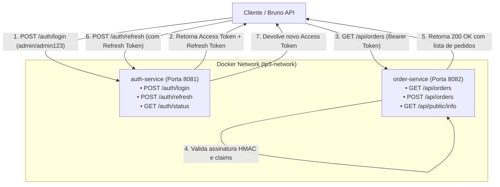

# TP3: Autenticação e Autorização em Microsserviços

Trabalho prático focado em resolver autenticação e controle de acesso em arquitetura de microsserviços usando Spring Boot 3 e tokens JWT (JSON Web Tokens).

A ideia central do projeto foi separar completamente a responsabilidade de quem autentica e emite tokens (`auth-service`) de quem consome e valida as requisições de negócio (`order-service`), mantendo a comunicação descentralizada e sem estado (stateless).

---

## 1. Visão Geral da Arquitetura

O ecossistema é formado por dois serviços conteinerizados rodando em uma mesma bridge network no Docker:



### Divisão de Responsabilidades
- **`auth-service` (Porta 8081)**: Cuida exclusivamente de credenciais e ciclo de vida dos tokens. É onde o usuário bate para fazer login e renovar a sessão. Ele emite dois tipos de token:
  - **Access Token**: Curto (15 minutos), usado diretamente no cabeçalho `Authorization: Bearer <token>` para consumir as APIs.
  - **Refresh Token**: Longo (24 horas), guardado para renovar o acesso sem forçar o usuário a digitar a senha novamente.
- **`order-service` (Porta 8082)**: Cuida das regras de negócio e catálogo de pedidos. Não consulta banco de usuários nem chama o `auth-service` a cada requisição; ele intercepta a requisição via `JwtAuthenticationFilter`, confere se a assinatura do token bate com a chave secreta compartilhada e libera ou barra a rota na hora.

---

## 2. Por que JWT em vez de Keycloak?

A especificação do trabalho permitia escolher entre JWT direto ou Keycloak. A opção adotada foi implementar com **JWT puro via Spring Security 6 e JJWT (0.12.6)** pelos seguintes motivos práticos:

1. **Eficiência e Consumo de Memória**: O Keycloak precisa de um banco de dados próprio (como PostgreSQL) e consome facilmente mais de 1 GB de RAM só para subir. Em máquinas de desenvolvimento e contêineres locais, isso pesa bastante. Já os nossos dois microsserviços juntos rodam com menos de 200 MB de RAM em contêineres Alpine JRE.
2. **Arquitetura Desacoplada e Rápida**: Com o JWT assinado simetricamente (HMAC-SHA), o `order-service` valida autenticidade e permissões de forma 100% autônoma na memória da JVM, sem latência extra de rede para checar sessão em servidor central.
3. **Controle Fino das Regras**: Conseguimos definir claims específicos (`token_type: ACCESS` vs `REFRESH`) para evitar que tokens de renovação sejam usados indevidamente para acessar recursos de dados.

---

## 3. Usuários para Teste

Os usuários já sobem cadastrados em memória, com senhas criptografadas via **BCrypt**:

| Usuário | Senha | Perfil | Descrição |
| :--- | :--- | :--- | :--- |
| `admin` | `admin123` | `ROLE_ADMIN` | Acesso administrativo completo |
| `user` | `user123` | `ROLE_USER` | Usuário padrão para criação de pedidos |

---

## 4. Endpoints Disponíveis

### 4.1. `auth-service` (Porta 8081)

| Método | Rota | Requer Autenticação | Objetivo | Status Sucesso |
| :--- | :--- | :---: | :--- | :---: |
| `POST` | `/auth/login` | Não | Valida usuário/senha e retorna os tokens | `200 OK` |
| `POST` | `/auth/refresh` | Não | Recebe refresh token e gera novo access token | `200 OK` |
| `GET` | `/auth/status` | Não | Healthcheck do serviço de autenticação | `200 OK` |

### 4.2. `order-service` (Porta 8082)

| Método | Rota | Requer Autenticação | Objetivo | Status Sucesso |
| :--- | :--- | :---: | :--- | :---: |
| `GET` | `/api/public/info` | **Não** | Informações públicas e status da API | `200 OK` |
| `GET` | `/api/orders` | **Sim (Bearer)** | Lista os pedidos cadastrados | `200 OK` |
| `GET` | `/api/orders/{id}` | **Sim (Bearer)** | Consulta detalhes de um pedido por ID | `200 OK` |
| `POST` | `/api/orders` | **Sim (Bearer)** | Cria um novo pedido atribuído ao usuário logado | `201 Created` |

---

## 5. Como Subir o Projeto

### Opção 1: Via Docker Compose (Mais fácil)

Basta rodar na raiz do projeto:

```bash
# Build das imagens e inicialização dos contêineres
docker compose up -d --build

# Ver se os serviços estão de pé e quais portas estão mapeadas
docker compose ps

# Ver os logs subindo em tempo real
docker compose logs -f

# Para derrubar quando terminar
docker compose down
```

### Opção 2: Direto pelo Maven (Local)

Se quiser rodar fora do Docker, abra dois terminais:

```bash
# Terminal 1: auth-service (Porta 8081)
cd auth-service
mvn spring-boot:run

# Terminal 2: order-service (Porta 8082)
cd order-service
mvn spring-boot:run
```

---

## 6. Coleção de Requisições (Bruno)

A coleção de requisições para validação dos endpoints e fluxo de renovação de tokens está organizada na pasta [`bruno/`](./bruno), pronta para uso com o ambiente `local`.

